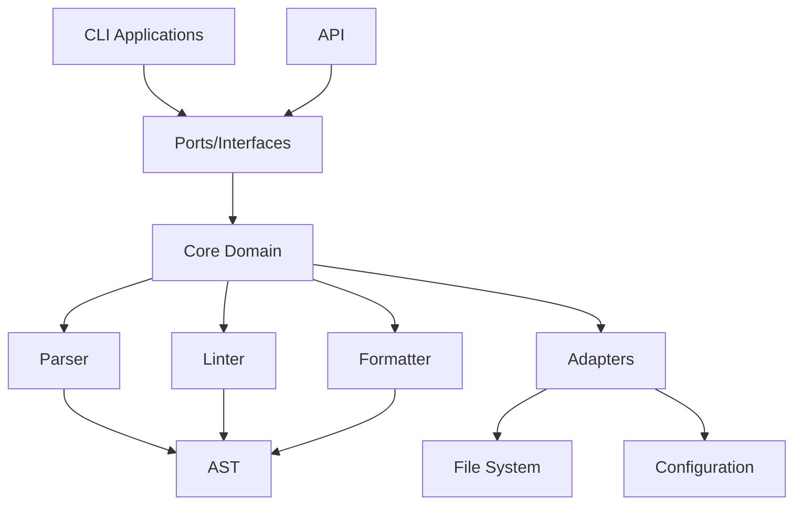
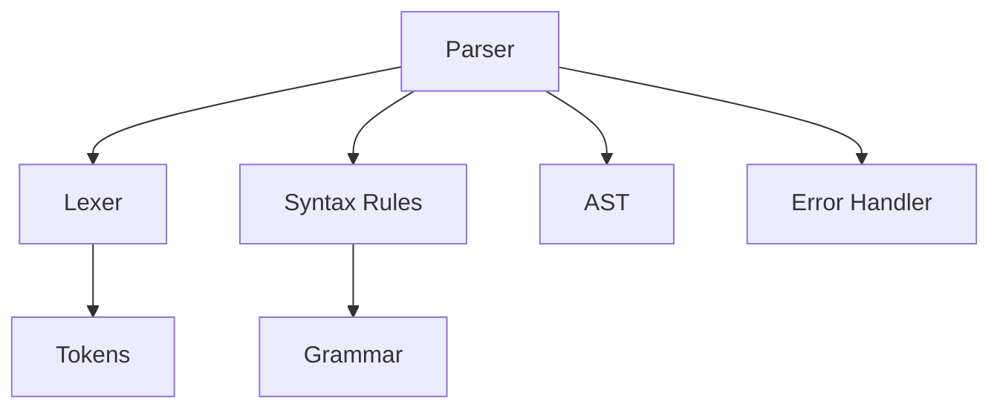
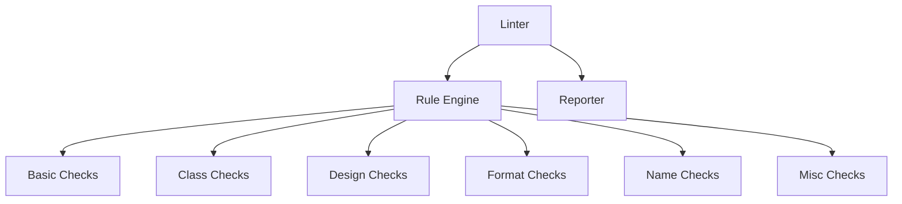
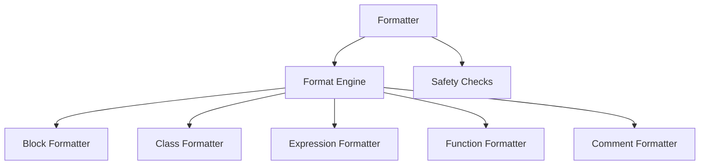
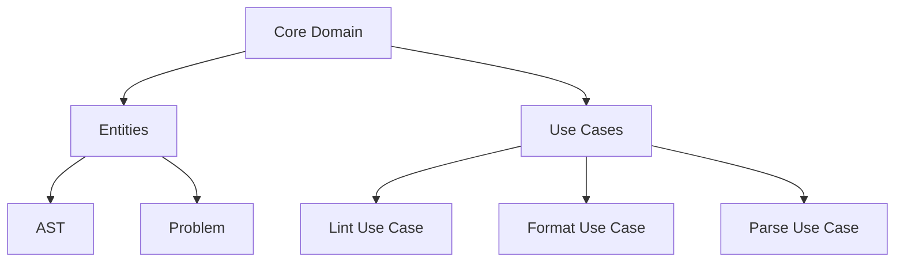

# Architecture for Go GDToolkit (gogdtoolkit)

## 1. Overview

The Go GDToolkit will be a port of the Python gdtoolkit's linter and formatter components, following a hexagonal architecture pattern to ensure clean separation of concerns. The implementation will use a hand-written recursive descent parser, maintain YAML configuration compatibility, and follow Go best practices.

## 2. High-Level Architecture



The architecture follows a hexagonal pattern with:
- **Core domain**: Contains the business logic (parser, linter, formatter)
- **Ports**: Interfaces for interacting with the core
- **Adapters**: Implementations connecting core to external concerns

## 3. Core Components

### 3.1 Parser Component



#### Key Components:
- **Lexer**: Converts source code into tokens
- **Parser**: Implements recursive descent parsing to build the AST
- **AST**: Go structs representing the Abstract Syntax Tree
- **Error Handler**: Manages error reporting and recovery

#### Grammar Implementation:

Instead of the declarative Lark grammar file, we'll implement the grammar as a set of structured Go types and functions:

```go
// Token types
const (
    TOKEN_IDENTIFIER TokenType = iota
    TOKEN_KEYWORD
    TOKEN_OPERATOR
    TOKEN_STRING
    TOKEN_NUMBER
    // ...other token types
)

// Grammar rules as functions
func parseStatement() (ast.Statement, error) {
    // Implementation of statement parsing
}

func parseExpression() (ast.Expression, error) {
    // Implementation of expression parsing
}
```

The lexer will be implemented as a state machine:

```go
type Lexer struct {
    input        string
    position     int
    readPosition int
    ch           byte
    line         int
    column       int
}

func (l *Lexer) NextToken() Token {
    // State machine implementation
    // Returns the next token from the input
}
```

The parser will use recursive descent with predictive parsing, with each grammar rule from the Lark grammar translated to a parsing function.

#### Error Handling and Recovery:

We'll implement rich error types with detailed information:

```go
type ParseError struct {
    Position  Position // Line and column information
    Message   string   // Human-readable error message
    Expected  []string // What tokens were expected
    Found     string   // What token was actually found
    Context   string   // Surrounding code context
    Severity  ErrorSeverity // Error, Warning, etc.
    ErrorCode string   // Unique identifier for this error type
}
```

Multiple error recovery strategies will be implemented:
1. **Panic Mode Recovery**: Skip tokens until a synchronization point
2. **Error Productions**: Handle common syntax errors gracefully
3. **Error Aggregation**: Collect multiple errors when possible

We'll provide detailed, contextual error messages and design our error reporting to integrate with IDE tools.

### 3.2 Linter Component



#### Key Components:
- **Rule Engine**: Manages and applies linting rules
- **Check Modules**: Implement specific checks (similar to Python version)
- **Reporter**: Formats and outputs linting issues

### 3.3 Formatter Component



#### Key Components:
- **Format Engine**: Coordinates the formatting process
- **Formatters**: Format specific language constructs
- **Safety Checks**: Ensure formatting doesn't change semantics

## 4. Hexagonal Architecture Implementation

### 4.1 Core Domain

The core domain contains the business logic independent of external concerns:



### 4.2 Ports (Interfaces)

Ports define how the outside world interacts with the core domain:

```go
// Primary port for linting
type LinterPort interface {
    Lint(code string, config Config) ([]Problem, error)
    LintFile(filePath string, config Config) ([]Problem, error)
}

// Primary port for formatting
type FormatterPort interface {
    Format(code string, config Config) (string, error)
    FormatFile(filePath string, config Config) error
}

// Secondary port for file system operations
type FileSystemPort interface {
    ReadFile(path string) (string, error)
    WriteFile(path string, content string) error
    FindFiles(pattern string, excludeDirs []string) ([]string, error)
}

// Secondary port for configuration
type ConfigPort interface {
    LoadConfig(path string) (Config, error)
    GetDefaultConfig() Config
}
```

### 4.3 Adapters

Adapters implement the ports to connect the core domain with external concerns:

```go
// CLI adapter for the linter
type CLILinterAdapter struct {
    linter LinterPort
    fs     FileSystemPort
    config ConfigPort
}

// File system adapter
type OSFileSystemAdapter struct{}

func (fs *OSFileSystemAdapter) ReadFile(path string) (string, error) {
    // Implementation using os package
}

// YAML configuration adapter
type YAMLConfigAdapter struct{}

func (c *YAMLConfigAdapter) LoadConfig(path string) (Config, error) {
    // Implementation using yaml package
}
```

## 5. Package Structure

```
gogdtoolkit/
├── cmd/
│   ├── gdlint/
│   └── gdformat/
├── internal/
│   ├── core/
│   │   ├── ast/
│   │   ├── parser/
│   │   ├── linter/
│   │   │   ├── rules/
│   │   │   └── problem/
│   │   └── formatter/
│   ├── ports/
│   │   ├── primary/
│   │   └── secondary/
│   └── adapters/
│       ├── primary/
│       └── secondary/
├── pkg/
│   └── gdscript/
└── test/
    ├── integration/
    ├── fixtures/
    └── acceptance/
```

## 6. Mapping Python Components to Go

### 6.1 Parser Mapping

| Python Component | Go Component |
|------------------|--------------|
| `parser.py` | `internal/core/parser/parser.go` |
| `gdscript.lark` | `internal/core/parser/grammar.go` |
| `gdscript_indenter.py` | `internal/core/parser/indenter.go` |

### 6.2 Linter Mapping

| Python Component | Go Component |
|------------------|--------------|
| `linter/__init__.py` | `internal/core/linter/linter.go` |
| `linter/problem.py` | `internal/core/linter/problem/problem.go` |
| `linter/basic_checks.py` | `internal/core/linter/rules/basic.go` |
| `linter/class_checks.py` | `internal/core/linter/rules/class.go` |
| `linter/design_checks.py` | `internal/core/linter/rules/design.go` |
| `linter/format_checks.py` | `internal/core/linter/rules/format.go` |
| `linter/name_checks.py` | `internal/core/linter/rules/name.go` |
| `linter/misc_checks.py` | `internal/core/linter/rules/misc.go` |

### 6.3 Formatter Mapping

| Python Component | Go Component |
|------------------|--------------|
| `formatter/__init__.py` | `internal/core/formatter/formatter.go` |
| `formatter/formatter.py` | `internal/core/formatter/engine.go` |
| `formatter/block.py` | `internal/core/formatter/block.go` |
| `formatter/class_statement.py` | `internal/core/formatter/class.go` |
| `formatter/expression.py` | `internal/core/formatter/expression.go` |
| `formatter/function_statement.py` | `internal/core/formatter/function.go` |
| `formatter/comments.py` | `internal/core/formatter/comment.go` |
| `formatter/safety_checks.py` | `internal/core/formatter/safety.go` |

## 7. Test Suite Structure

Following your preference for a hybrid approach:

1. **Unit Tests**: Placed alongside implementation files
   - `parser.go` → `parser_test.go`
   - `linter.go` → `linter_test.go`

2. **Integration Tests**: In a separate directory
   - `test/integration/parser_linter_test.go`
   - `test/integration/formatter_test.go`

3. **Acceptance Tests**: Using the same test fixtures as the Python version
   - `test/acceptance/linter_test.go`
   - `test/acceptance/formatter_test.go`

## 8. Key Implementation Considerations

### 8.1 Parser Implementation

The recursive descent parser will:
1. Define tokens and lexer for GDScript
2. Implement parsing functions for each grammar rule
3. Build an AST that's compatible with both linter and formatter

### 8.2 AST Design

The AST will be implemented as Go structs with:
1. Clear type hierarchies using interfaces
2. Visitor pattern support for traversal
3. Position information for error reporting

```go
// Base node interface
type Node interface {
    Position() Position
    TokenLiteral() string
}

// Statement interface
type Statement interface {
    Node
    statementNode()
}

// Expression interface
type Expression interface {
    Node
    expressionNode()
}

// Concrete implementation
type FunctionDefinition struct {
    Pos      Position
    Name     string
    Args     []*FunctionArgument
    ReturnType string
    Body     []Statement
}

func (fd *FunctionDefinition) statementNode() {}
func (fd *FunctionDefinition) TokenLiteral() string { return fd.Name }
func (fd *FunctionDefinition) Position() Position { return fd.Pos }
```

### 8.3 Concurrency

We'll leverage Go's concurrency features:
1. Process multiple files in parallel
2. Apply linting rules concurrently where possible
3. Use worker pools for batch processing

```go
func (l *Linter) LintFiles(files []string, config Config) (map[string][]Problem, error) {
    results := make(map[string][]Problem)
    var mu sync.Mutex
    var wg sync.WaitGroup
    
    // Create a worker pool
    workerCount := runtime.NumCPU()
    filesChan := make(chan string, len(files))
    
    // Start workers
    for i := 0; i < workerCount; i++ {
        wg.Add(1)
        go func() {
            defer wg.Done()
            for file := range filesChan {
                content, err := l.fs.ReadFile(file)
                if err != nil {
                    mu.Lock()
                    results[file] = []Problem{{Message: fmt.Sprintf("Failed to read file: %v", err)}}
                    mu.Unlock()
                    continue
                }
                
                problems, err := l.Lint(content, config)
                if err != nil {
                    mu.Lock()
                    results[file] = []Problem{{Message: fmt.Sprintf("Failed to lint: %v", err)}}
                    mu.Unlock()
                    continue
                }
                
                mu.Lock()
                results[file] = problems
                mu.Unlock()
            }
        }()
    }
    
    // Send files to workers
    for _, file := range files {
        filesChan <- file
    }
    close(filesChan)
    
    // Wait for all workers to finish
    wg.Wait()
    
    return results, nil
}
```

### 8.4 Configuration Compatibility

The Go implementation will:
1. Support the same YAML configuration format
2. Provide default configurations matching Python version
3. Implement the same configuration search logic

```go
func FindConfigFile() string {
    dir, err := os.Getwd()
    if err != nil {
        return ""
    }
    
    for {
        configPath := filepath.Join(dir, "gdlintrc")
        if _, err := os.Stat(configPath); err == nil {
            return configPath
        }
        
        configPath = filepath.Join(dir, ".gdlintrc")
        if _, err := os.Stat(configPath); err == nil {
            return configPath
        }
        
        parent := filepath.Dir(dir)
        if parent == dir {
            break
        }
        dir = parent
    }
    
    return ""
}
```

## 9. Implementation Roadmap

1. **Phase 1**: Core AST and Parser
   - Implement lexer and token definitions
   - Develop recursive descent parser
   - Define AST structures

2. **Phase 2**: Linter Core
   - Implement rule engine
   - Port basic linting rules
   - Develop problem reporting

3. **Phase 3**: Formatter Core
   - Implement formatting engine
   - Port basic formatting rules
   - Develop safety checks

4. **Phase 4**: CLI and Integration
   - Implement command-line interfaces
   - Add configuration handling
   - Integrate components

5. **Phase 5**: Advanced Features and Optimization
   - Port remaining linting rules
   - Optimize performance
   - Add concurrency support