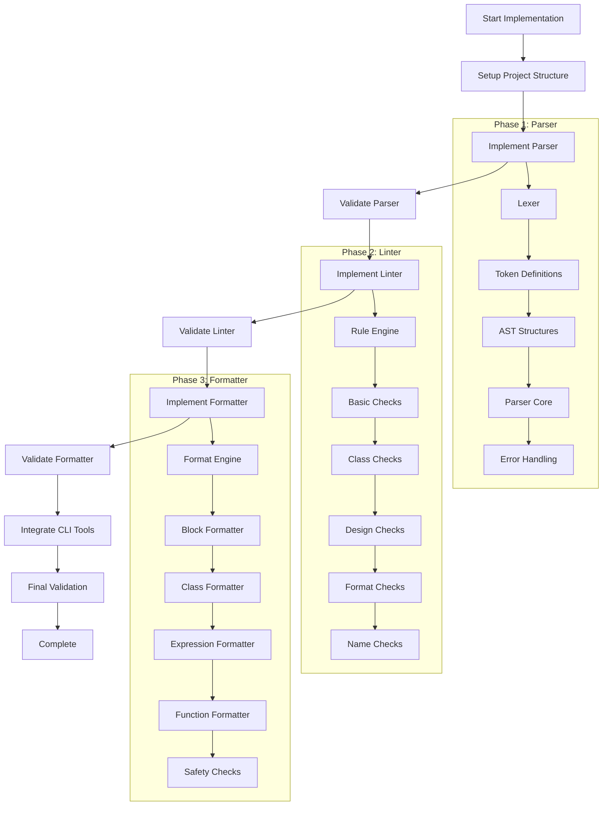

# Go GDToolkit (gogdtoolkit) Implementation Plan

## Implementation Flow

## Detailed Implementation Plan

### Phase 0: Project Setup and Infrastructure

- [x] **Setup Basic Project Structure**
  - [x] Create directory structure according to architecture document
  - [x] Setup Go modules and initial dependencies
  - [x] Create README and documentation files
  - [ ] Setup GitHub Actions for CI/CD

- [ ] **Setup Testing Infrastructure**
  - [ ] Create test utilities for comparing Go and Python outputs
  - [ ] Copy test fixtures from Python implementation
  - [ ] Setup benchmarking infrastructure

### Phase 1: Parser Implementation

- [x] **1.1 Implement Token Definitions and Lexer**
  - [x] Define token types and constants
  - [x] Implement lexer state machine
  - [x] Add position tracking for error reporting
  - [x] Add support for comments and whitespace
  - [x] **Validation**: Unit tests for lexer with simple token sequences

- [x] **1.2 Implement AST Structures**
  - [x] Define Node interface and base types
  - [x] Implement Statement interface and concrete types
  - [x] Implement Expression interface and concrete types
  - [x] Add position information to all AST nodes
  - [x] Implement visitor pattern for AST traversal
  - [x] **Validation**: Unit tests for AST node creation and traversal

- [x] **1.3 Implement Core Parser**
  - [x] Implement recursive descent parser framework
  - [x] Add parsing functions for statements
  - [x] Add parsing functions for expressions
  - [x] Implement operator precedence handling
  - [x] **Validation**: Parse simple GDScript snippets

- [x] **1.4 Implement Error Handling and Recovery**
  - [x] Define error types with position information
  - [x] Implement panic mode recovery
  - [x] Add error productions for common mistakes
  - [x] Implement error aggregation
  - [x] **Validation**: Test error reporting with invalid syntax

- [❌] **1.5 Complete Parser Implementation** - **CRITICAL ISSUES DISCOVERED**
  - [x] Implement all remaining grammar rules
  - [x] Add support for all GDScript language features
  - [ ] Optimize parser performance
  - [❌] **Validation**: Parse all valid test scripts from Python implementation - **FAILING**
  - [❌] **Validation**: Ensure invalid scripts fail with appropriate errors - **FAILING**
  - [❌] **CRITICAL**: Function definition parsing fails (`func foo():`)
  - [❌] **CRITICAL**: Class definition parsing fails (`class MyClass:`)
  - [❌] **CRITICAL**: Expression parsing in control structures fails
  - [❌] **CRITICAL**: Function parameter parsing fails

### Phase 2: Linter Implementation

- [x] **2.1 Implement Linter Core and Rule Engine**
  - [x] Define problem types and severity levels
  - [x] Implement rule engine framework
  - [x] Add configuration loading and validation
  - [ ] Implement rule disabling via comments
  - [ ] **Validation**: Test rule engine with simple rules

- [x] **2.2 Implement Basic Checks**
  - [x] Port expression-not-assigned check
  - [x] Port unnecessary-pass check
  - [ ] Port duplicated-load check
  - [ ] Port unused-argument check
  - [ ] Port comparison-with-itself check
  - [ ] **Validation**: Compare results with Python implementation on test cases

- [ ] **2.3 Implement Class Checks**
  - [ ] Port private-method-call check
  - [ ] Port class-definitions-order check
  - [ ] Port class-variable-name check
  - [ ] Port useless-super-delegation check
  - [ ] **Validation**: Compare results with Python implementation on test cases

- [ ] **2.4 Implement Design Checks**
  - [ ] Port max-public-methods check
  - [ ] Port max-returns check
  - [ ] Port max-branches check
  - [ ] Port max-statements check
  - [ ] Port max-attributes check
  - [ ] Port max-local-variables check
  - [ ] Port function-arguments-number check
  - [ ] **Validation**: Compare results with Python implementation on test cases

- [ ] **2.5 Implement Format Checks**
  - [ ] Port max-file-lines check
  - [ ] Port trailing-whitespace check
  - [ ] Port mixed-tabs-and-spaces check
  - [ ] Port no-tabs check
  - [ ] Port indent-error check
  - [ ] **Validation**: Compare results with Python implementation on test cases

- [ ] **2.6 Implement Name Checks**
  - [ ] Port function-name check
  - [ ] Port class-name check
  - [ ] Port sub-class-name check
  - [ ] Port constant-name check
  - [ ] Port load-constant-name check
  - [ ] **Validation**: Compare results with Python implementation on test cases

- [ ] **2.7 Complete Linter Implementation**
  - [ ] Implement any remaining checks
  - [ ] Add parallel processing for multiple files
  - [ ] Optimize linter performance
  - [ ] **Validation**: Run against all test fixtures and compare with Python

### Phase 3: Formatter Implementation

- [ ] **3.1 Implement Formatter Core and Engine**
  - [ ] Define formatting context and state
  - [ ] Implement basic whitespace and indentation handling
  - [ ] Add configuration loading and validation
  - [ ] **Validation**: Format simple code snippets

- [ ] **3.2 Implement Block Formatter**
  - [ ] Implement statement block formatting
  - [ ] Add support for if/else blocks
  - [ ] Add support for loop blocks
  - [ ] Add support for match blocks
  - [ ] **Validation**: Compare formatted blocks with Python implementation

- [ ] **3.3 Implement Class Formatter**
  - [ ] Implement class definition formatting
  - [ ] Add support for class variables
  - [ ] Add support for inner classes
  - [ ] Add support for class annotations
  - [ ] **Validation**: Compare formatted classes with Python implementation

- [ ] **3.4 Implement Expression Formatter**
  - [ ] Implement binary expression formatting
  - [ ] Add support for function calls
  - [ ] Add support for array and dictionary literals
  - [ ] Add support for type casts and tests
  - [ ] **Validation**: Compare formatted expressions with Python implementation

- [ ] **3.5 Implement Function Formatter**
  - [ ] Implement function definition formatting
  - [ ] Add support for function parameters
  - [ ] Add support for return type annotations
  - [ ] Add support for function annotations
  - [ ] **Validation**: Compare formatted functions with Python implementation

- [ ] **3.6 Implement Comment Formatter**
  - [ ] Add support for line comments
  - [ ] Add support for block comments
  - [ ] Add support for docstrings
  - [ ] **Validation**: Compare comment formatting with Python implementation

- [ ] **3.7 Implement Safety Checks**
  - [ ] Add validation that formatting preserves semantics
  - [ ] Implement AST comparison before and after formatting
  - [ ] Add checks for edge cases and potential issues
  - [ ] **Validation**: Run safety checks on all test fixtures

- [ ] **3.8 Complete Formatter Implementation**
  - [ ] Implement any remaining formatting rules
  - [ ] Optimize formatter performance
  - [ ] **Validation**: Format all test fixtures and compare with Python

### Phase 4: CLI and Integration

- [x] **4.1 Implement CLI for Linter (gdlint)**
  - [x] Create command-line interface
  - [x] Add file and directory handling
  - [ ] Implement configuration file loading
  - [ ] Add output formatting options
  - [ ] **Validation**: Compare CLI behavior with Python implementation

- [x] **4.2 Implement CLI for Formatter (gdformat)**
  - [x] Create command-line interface
  - [x] Add file and directory handling
  - [ ] Implement configuration file loading
  - [ ] Add output formatting options
  - [ ] **Validation**: Compare CLI behavior with Python implementation

- [ ] **4.3 Complete Integration**
  - [ ] Ensure all components work together correctly
  - [ ] Add comprehensive error handling
  - [ ] Implement logging and debugging features
  - [ ] **Validation**: End-to-end testing with real-world scripts

### Phase 5: Final Validation and Optimization

- [ ] **5.1 Comprehensive Testing**
  - [ ] Run all test fixtures from Python implementation
  - [ ] Compare outputs between Go and Python implementations
  - [ ] Test with real-world GDScript projects
  - [ ] **Validation**: Ensure 1:1 correctness with Python implementation

- [ ] **5.2 Performance Optimization**
  - [ ] Profile and optimize parser performance
  - [ ] Profile and optimize linter performance
  - [ ] Profile and optimize formatter performance
  - [ ] Implement additional concurrency where beneficial
  - [ ] **Validation**: Benchmark against Python implementation

- [ ] **5.3 Documentation and Finalization**
  - [ ] Complete API documentation
  - [ ] Add usage examples and tutorials
  - [ ] Create release notes and migration guide
  - [ ] Prepare for initial release
  - [ ] **Validation**: Review documentation for completeness

## Test Cases and Validation Strategy

### Parser Test Cases
- [x] Basic syntax: variables, functions, classes
- [x] Expressions: arithmetic, logical, comparison
- [x] Control structures: if/else, loops, match
- [ ] Advanced features: lambdas, signals, annotations
- [x] Error cases: invalid syntax, missing tokens

### Linter Test Cases
- [ ] Basic checks: expression-not-assigned, unnecessary-pass
- [ ] Class checks: private-method-call, class-definitions-order
- [ ] Design checks: max-public-methods, max-returns
- [ ] Format checks: max-file-lines, trailing-whitespace
- [ ] Name checks: function-name, class-name

### Formatter Test Cases
- [ ] Basic formatting: indentation, whitespace
- [ ] Statement formatting: if/else, loops, match
- [ ] Expression formatting: function calls, operators
- [ ] Class formatting: variables, methods, inner classes
- [ ] Comment formatting: line comments, docstrings

### Validation Approach
1. For each component, implement unit tests that verify individual functions
2. Use the same test fixtures from the Python implementation
3. Compare outputs between Go and Python implementations
4. For each rule or feature, create specific test cases that verify correctness
5. Implement integration tests that verify components work together correctly
6. Use real-world GDScript files to validate the complete implementation